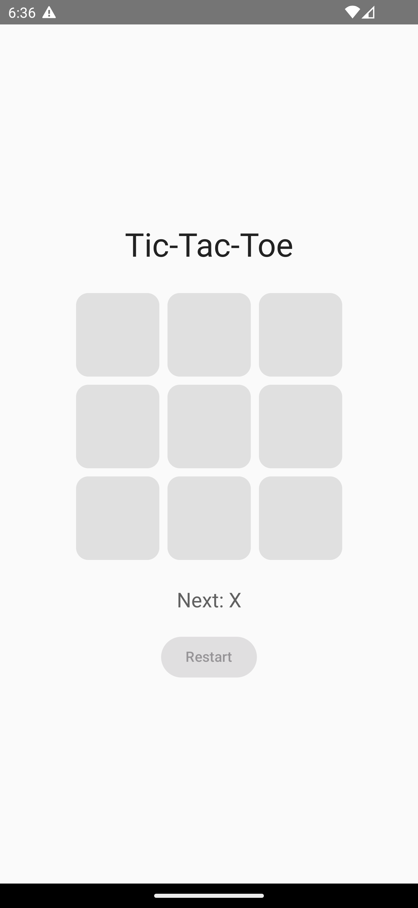
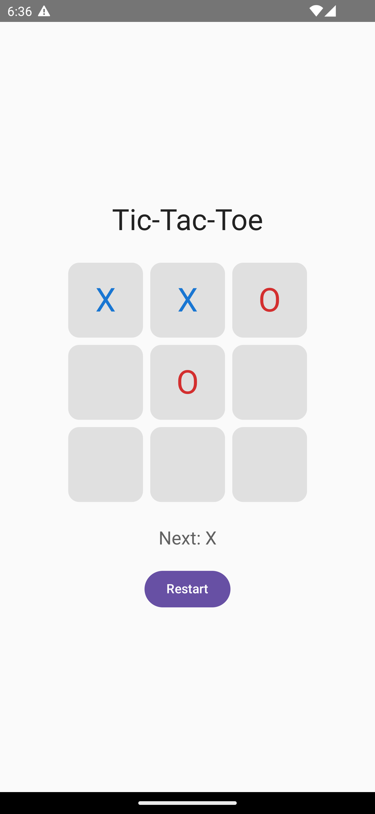
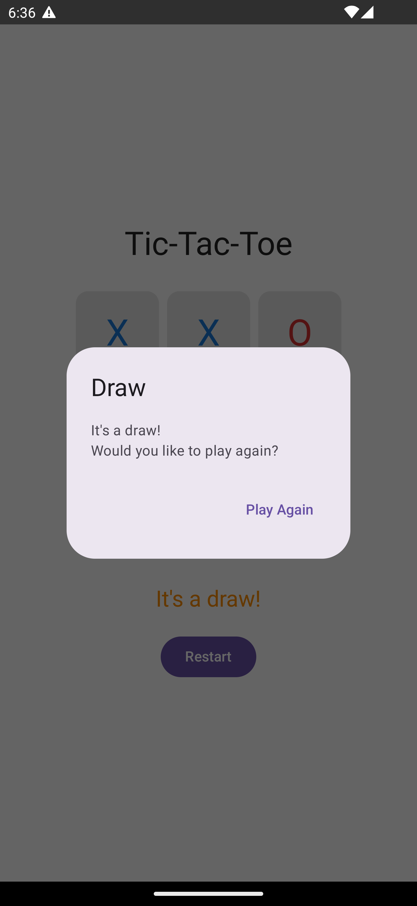
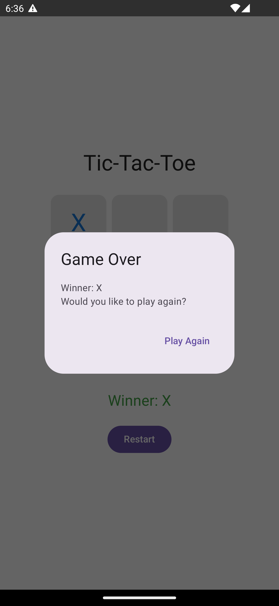

# XoxGame

XoxGame is a simple Tic-Tac-Toe application written in **Kotlin** using **Jetpack Compose**. Two players take turns placing X and O markers on a 3x3 board. The application detects wins or draws and allows the game to be restarted.

## Technologies

- **Kotlin** programming language
- **Jetpack Compose** for UI
- **MVVM architecture** with `ViewModel`, `UseCase`, and `Repository` layers
- **Material 3** components

## Application Structure

The project follows a clean structure:

- `domain` layer holds the core models (`Board`, `Player`) and use cases.
- `data` layer provides a simple in-memory implementation of `GameRepository`.
- `presentation` layer contains the Compose UI (`XoxGameScreen`) and the `GameViewModel` responsible for game logic.
- `di` package exposes use case instances through a lightweight `AppModule` object.

The entry point `XoxApp` sets up the Compose content and displays the game screen.

## Screenshots

Below are sample screens from the application.

  
  
  
  

