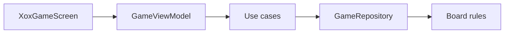

# XOX Game

[](https://kotlinlang.org/)
[](https://developer.android.com/jetpack/compose)
[](https://developer.android.com/build/releases/gradle-plugin)
[](https://android-arsenal.com/api?level=26)

A compact Tic-Tac-Toe client for Android. Two players share one device, take turns placing **X** and **O** on a 3×3 board, and the app reports a win, a draw, or the next player.

## Features

- Turn-based 3×3 gameplay with occupancy and end-game guards
- Win detection for rows, columns, and both diagonals
- Draw detection when the board is full with no winner
- Restart from the board or from the end-of-game dialog
- Material 3 theming, including dynamic color on Android 12+
- Edge-to-edge layout with safe drawing insets

## Tech stack

| Area | Choice |
| --- | --- |
| Language | Kotlin 2.4.20 |
| UI | Jetpack Compose, Material 3 (`compose-bom:2026.08.00`) |
| Architecture | Clean layers + MVVM (`StateFlow`, `ViewModel`) |
| DI | Lightweight `AppModule` factory (no Hilt) |
| Build | AGP 9.4.0, Gradle 9.6.0, JDK 17 |
| SDK | `minSdk 26`, `targetSdk 36`, `compileSdk 37` |

## Architecture

```
app/
├── data/            In-memory GameRepository implementation
├── di/              Use case and ViewModel factory wiring
├── domain/
│   ├── model/       Board, Player
│   ├── repository/  GameRepository contract
│   └── usecase/     GetBoard, MakeMove, ResetGame
└── presentation/    Compose UI, UI state, GameViewModel
```


```mermaid
flowchart LR
    UI[XoxGameScreen] --> VM[GameViewModel]
    VM --> UC[Use cases]
    UC --> Repo[GameRepository]
    Repo --> Board[Board rules]
```

Game rules live on `Board` (winner, draw, occupancy). The ViewModel only maps those facts into `GameUiState`. The repository keeps a single in-memory board for the current session.

## Getting started

### Requirements

- Android Studio with JDK 17
- Android SDK 37 (compile) and a device or emulator on API 26+

### Run

```bash
git clone https://github.com/halilozel1903/XOXGame.git
cd XOXGame
./gradlew :app:assembleDebug
```

Install the debug APK from Android Studio (**Run**) or with `./gradlew :app:installDebug`.

### Test

```bash
./gradlew :app:testDebugUnitTest
```

## Project notes

- `XoxApp` is the launcher `ComponentActivity`. It applies `XoxGameTheme` and obtains `GameViewModel` through `AppModule.gameViewModelFactory`, so the ViewModel survives configuration changes.
- Strings are in `app/src/main/res/values/strings.xml`.
- Unit tests cover board outcomes and repository move/reset behavior.

## License

This project is provided as an open sample for learning Jetpack Compose and layered Android architecture.
